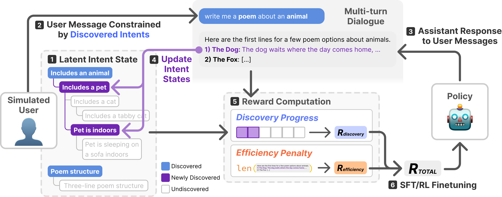

# DiscoverLLM: From Executing Intents to Discovering Them

<div align="left">

[](https://taesookim.com/discoverllm)
[](https://arxiv.org/abs/2602.03429)
[](https://huggingface.co/collections/kixlab/discoverllm-icml-2026)
[](https://opensource.org/licenses/MIT)
[](https://www.python.org/downloads/)

</div>

📢 Accepted at **ICML 2026**

# Overview

<p align="center">
  
</p>

DiscoverLLM trains LLMs to help users figure out what they want, not just execute what they ask. LLM training and evaluation assume users start with fully-formed intents. Often they don't: users approach open-ended tasks with **ill-defined intents** that they discover by reacting to what the model proposes. DiscoverLLM models this via a **user simulator** with an explicit latent intent hierarchy: each node advances through *undiscovered → emerging → discovered* as the assistant engages it (via a clarifying question or a generated artifact), and the simulator emits a reward equal to the count of newly-discovered nodes per turn. The same simulator drives both **data synthesis** (best-of-N rollouts → preference data) and **online RL** (live judge for DPO / GRPO).

For an interactive walkthrough, see the [project page](https://taesookim.com/discoverllm).

---

## Installation

```bash
# Simulation / evaluation only
pip install -e .

# Add training dependencies (TRL, PEFT, DeepSpeed, etc.)
pip install -e ".[train]"

# Add dev tools (ruff, black)
pip install -e ".[dev]"
```

Copy `.env.example` to `.env` and fill in the API keys you'll use (`OPENAI_API_KEY`, `ANTHROPIC_API_KEY`, `GEMINI_API_KEY`, `TOGETHER_API_KEY`, `HF_TOKEN`).

## Quick Start

* **Run an evaluation:** put N assistants up against the same artifacts and compare discovery / satisfaction / interactivity metrics with a single command. See [Running a simulator experiment](#running-a-simulator-experiment).
* **Synthesize training data:** generate best-of-N preference data with the same loop, then materialize into a HuggingFace dataset. See [Building a training dataset](#building-a-training-dataset).
* **Train offline:** SFT on winning trajectories, then offline DPO on preference pairs (signals derived from the simulator at synthesis time). See [Training](#training).
* **Train online:** Online DPO / GRPO with the simulator as a live judge during rollouts. Same simulator, no extra human data.
* **Use the released checkpoints:** load any of the six LoRA adapters in two lines of PEFT. See [Released Models and Dataset](#released-models-and-dataset).

## Released Models and Dataset

We release the preference dataset and six LoRA adapters used in the paper under the [`kixlab`](https://huggingface.co/collections/kixlab/discoverllm-icml-2026) HuggingFace org.

**Dataset** — [`kixlab/DiscoverLLM-multiturn-preferences`](https://huggingface.co/datasets/kixlab/DiscoverLLM-multiturn-preferences) — three task subsets:

```python
from datasets import load_dataset

ds = load_dataset(
    "kixlab/DiscoverLLM-multiturn-preferences",
    "creative_writing",   # or "technical_writing", "svg_drawing"
    split="train",
)
```

**LoRA adapters** — three tasks × two base models:

| Task               | Llama-3.1-8B-Instruct (DPO) | Qwen3-8B (GRPO) |
| ------------------ | --------------------------- | --------------- |
| Creative writing   | [`kixlab/DiscoverLLM-creative-writing-Llama-3.1-8B-Instruct`](https://huggingface.co/kixlab/DiscoverLLM-creative-writing-Llama-3.1-8B-Instruct)   | [`kixlab/DiscoverLLM-creative-writing-Qwen3-8B`](https://huggingface.co/kixlab/DiscoverLLM-creative-writing-Qwen3-8B)   |
| Technical writing  | [`kixlab/DiscoverLLM-technical-writing-Llama-3.1-8B-Instruct`](https://huggingface.co/kixlab/DiscoverLLM-technical-writing-Llama-3.1-8B-Instruct) | [`kixlab/DiscoverLLM-technical-writing-Qwen3-8B`](https://huggingface.co/kixlab/DiscoverLLM-technical-writing-Qwen3-8B) |
| SVG illustration   | [`kixlab/DiscoverLLM-svg-drawing-Llama-3.1-8B-Instruct`](https://huggingface.co/kixlab/DiscoverLLM-svg-drawing-Llama-3.1-8B-Instruct)             | [`kixlab/DiscoverLLM-svg-drawing-Qwen3-8B`](https://huggingface.co/kixlab/DiscoverLLM-svg-drawing-Qwen3-8B)             |

```python
from transformers import AutoModelForCausalLM, AutoTokenizer
from peft import PeftModel
import torch

base_id    = "meta-llama/Llama-3.1-8B-Instruct"
adapter_id = "kixlab/DiscoverLLM-creative-writing-Llama-3.1-8B-Instruct"

tokenizer = AutoTokenizer.from_pretrained(adapter_id)
base = AutoModelForCausalLM.from_pretrained(base_id, torch_dtype=torch.bfloat16, device_map="auto")
model = PeftModel.from_pretrained(base, adapter_id)
```

The Llama base is gated on HuggingFace — accept the license at [`meta-llama/Llama-3.1-8B-Instruct`](https://huggingface.co/meta-llama/Llama-3.1-8B-Instruct) before loading. [`Qwen/Qwen3-8B`](https://huggingface.co/Qwen/Qwen3-8B) is not gated.

**Adapter licenses inherit from the base model:** the Llama-3.1 adapters are released under the [Llama 3.1 Community License](https://www.llama.com/llama3_1/license/) (same as the base). The Qwen3-8B adapters are released under Apache-2.0.

## How the Simulator Runs

The simulator runs in one of two modes. Both use the same multi-turn conversation loop with the same intent-aware user simulator; the only difference is what happens **at each turn**:

| Mode (`--mode`) | What happens each turn | Output | Typical use |
|---|---|---|---|
| `best_of_1` (default) | The single assistant generates one response, which is committed. | One JSON file per (artifact, assistant) pair | **Evaluation:** compare N assistants on the same artifacts. |
| `best_of_n` | Every assistant in `--assistant-configs-file` generates a candidate. The highest-reward candidate is committed; ALL candidates (with scores) are recorded. | One JSON file per artifact | **Synthesis:** generate best-of-N preference data for offline DPO, or curate one strong trajectory per artifact. |

Both modes write the same JSON shape (`ConversationResult`); `best_of_1` just leaves `per_turn_candidates` as `null`. Downstream readers in `discoverllm/analyze/` and `discoverllm/data/` only need to handle one format. The same simulator also drives **online RL training** (DPO, GRPO), judging rollouts in-process.

## Running a Simulator Experiment

**Best-of-1** — independent conversations per (artifact, assistant); used to evaluate multiple assistants on the same artifacts:

```bash
python -m discoverllm.simulate.run \
    examples/artifacts/articles_sample.json \
    outputs/best_of_1_demo \
    -a examples/configs/assistants.json \
    -u examples/configs/user.json \
    -r examples/configs/reward_assistant.json \
    --mode best_of_1 --max-turns 8 --parallel-workers 4
```

Output: `outputs/best_of_1_demo/<artifact_id>/<assistant_id>.json`, one file per (artifact, assistant) pair.

**Best-of-N** — every assistant generates a candidate per turn; the highest-reward one is committed; all are recorded:

```bash
python -m discoverllm.simulate.run \
    examples/artifacts/articles_sample.json \
    outputs/best_of_n_demo \
    -a examples/configs/assistants.json \
    -u examples/configs/user.json \
    -r examples/configs/reward_assistant.json \
    --mode best_of_n --max-turns 5 --parallel-workers 4
```

Output: `outputs/best_of_n_demo/<artifact_id>/best_of_n.json`, one file per artifact, with `per_turn_candidates` populated.

## Building a Training Dataset

After a `best_of_n` run, materialize a HuggingFace / JSON / JSONL dataset of preference pairs:

```bash
python -m discoverllm.data.build_dataset \
    --input_dir outputs/best_of_n_demo \
    --output outputs/datasets/best_of_n_demo \
    --save_format hf --score_type multiturn
```

## Training

Each algorithm has a thin shell wrapper under `scripts/train/` that fills in the multi-GPU launch flags. Example for SFT:

```bash
bash scripts/train/sft.sh \
    outputs/datasets/synth_demo \
    outputs/sft/llama-ours \
    meta-llama/Llama-3.1-8B-Instruct
```

The four trainers are:

| Algorithm    | Module                                              | Reward source |
|--------------|-----------------------------------------------------|---------------|
| SFT          | `discoverllm.training.trainers.sft`                 | dataset score |
| Offline DPO  | `discoverllm.training.trainers.offline_dpo`         | dataset preference pairs |
| Online DPO   | `discoverllm.training.trainers.online_dpo`          | user simulator (live) |
| GRPO         | `discoverllm.training.trainers.grpo`                | user simulator (live) |

The two online algorithms call into `discoverllm.pipeline.rewards` via `DesignLLMRewardComputer`, so the same user simulator that produces evaluation metrics is also the training judge — no extra human data is collected for the online phase.

## Serving Fine-Tuned LoRAs

Run a vLLM server with your trained adapter(s) loaded as `--lora-modules`, then add each LoRA's `name` to `OUR_MODELS` in `discoverllm/config.py` and make sure `OUR_URLS` points at the server. The dispatcher in `discoverllm/core/generate.py` routes any call whose `model_name` appears in `OUR_MODELS` to one of those URLs.

## Adapting to Your Own Task

To use DiscoverLLM on a new domain:

1. **Add artifacts:** drop a JSON file with the new artifacts under `examples/artifacts/` (any text/SVG/structured content with an identifier per item).
2. **(Optional) Adjust the user prompt:** the user simulator's behavior is driven by the YAML prompts in `discoverllm/core/prompts/`. Tune `create_criteria.yaml` and `abstract_criteria.yaml` if your domain has unusual intent structure.
3. **(Optional) Add a metric:** post-hoc LLM-judge metrics live under `discoverllm/analyze/`; each has its own prompt template + a shared `AnalyzerSpec` driver.

Then run `--mode best_of_n`, build the dataset, and train as usual.

## Repository Layout

```
discoverllm/
├── discoverllm/             # core package
│   ├── core/                # LLM dispatch, prompt templates, atomic tasks
│   ├── pipeline/            # stateful simulators (user, assistant, reward)
│   ├── simulate/            # experiment orchestration (best_of_1 + best_of_n)
│   ├── analyze/             # post-hoc LLM-judge scoring of run outputs
│   ├── data/                # dataset builders (best_of_n → HF/JSON/JSONL)
│   ├── training/            # fine-tuning code
│   │   ├── trainers/        # sft.py, offline_dpo.py, online_dpo.py, grpo.py
│   │   ├── datasets/        # multi-turn dataset loader
│   │   ├── prompts/         # ours system prompt
│   │   └── reward.py        # DesignLLMRewardComputer (online judge)
│   └── metrics/             # scoring utilities
├── scripts/                 # shell wrappers
│   ├── simulate/            # run_eval.sh, run_synth.sh
│   └── train/               # sft.sh, offline_dpo.sh, online_dpo.sh, grpo.sh
├── examples/                # minimal example configs + artifacts
└── docs/                    # GitHub Pages project page
```

## Citation

If you use this work, please cite:

```bibtex
@article{kim2026discoverllm,
  title={DiscoverLLM: From Executing Intents to Discovering Them},
  author={Kim, Tae Soo and Lee, Yoonjoo and Yu, Jaesang and Chung, John Joon Young and Kim, Juho},
  journal={arXiv preprint arXiv:2602.03429},
  year={2026}
}
```

`CITATION.cff` is also provided so GitHub renders a "Cite this repository" button.

## Attribution

The training pipeline (SFT / offline DPO / online DPO / GRPO trainers, the multi-turn dataset loader, and the system-prompt scaffolding) is adapted from **CollabLLM** ([Wu et al., 2025](https://github.com/Wuyxin/collabllm)).

The user simulator and evaluation pipeline (`discoverllm/core`, `discoverllm/pipeline`, `discoverllm/simulate`, `discoverllm/analyze`, `discoverllm/data`) are original to this work.

## License

Code in this repository is [MIT](LICENSE)-licensed. Released model adapters inherit the license of their base model (see [Released Models and Dataset](#released-models-and-dataset)).
